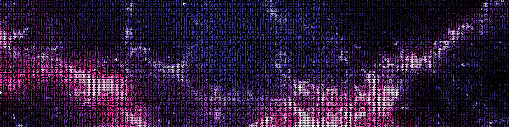

TEXTp Image Filter
===
A fun little Ember-CLI app that converts images into [TEXTp](http://youtube-global.blogspot.com/2010/03/textp-saves-youtube-bandwidth-money.html)&mdash;Youtube's 2010 April Fool's joke. Play with it [here](http://rzurad.github.io/TEXTp).



Supported platforms
====
Tested on Chrome 37, Firefox 32, Safari 7.1, IE 11, and Opera 24. Mobile devices are currently not supported.

Setup
====
This app uses Ember-CLI and is a static app. Everything happens locally in the browser and there is no need for a back-end. Build it and serve it:

```
npm install -g ember-cli
npm install -g bower
npm install
bower install
ember build --environment=production
```

or run a local server with:

```
ember serve
```
